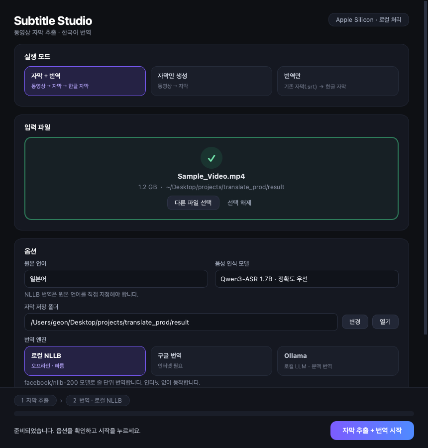

# translate_prod

로컬 Mac에서 동영상을 **STT(음성→자막) → 한국어 번역**까지 한 번에 처리하는 파이프라인입니다.  
STT는 Apple Silicon(MLX)에서 로컬로 동작하고, 번역은 로컬 모델(NLLB / Ollama) 또는 구글 번역 중에서 선택할 수 있습니다.  
데스크톱 GUI(`./gui.sh`)와 터미널(`./run.sh`) 두 가지 방식으로 사용할 수 있습니다.

## 사용 환경

| 항목 | 권장 사양 |
|------|-----------|
| 기기 | Mac mini M2 (또는 Apple Silicon Mac) |
| 메모리 | 16GB 이상 |
| 저장공간 | 512GB 이상 (모델·캐시 여유 필요) |
| OS | macOS |
| Python | **3.11** |
| GPU | Apple Metal (MPS / MLX) |

### 사용 모델

- **STT**: `mlx-community/Qwen3-ASR-1.7B-8bit` (`mlx-qwen3-asr`, 기본값) / `Qwen/Qwen3-ASR-1.7B` 원본 / `Qwen/Qwen3-ASR-0.6B`
- **번역(기본)**: `facebook/nllb-200-distilled-600M` 또는 `-1.3B` (Transformers + MPS, `import_srt.py`)
- **번역(선택)**: 구글 번역 (`google_translate_srt.py`)
- **번역(선택, 품질 우선)**: Ollama `qwen3:8b` 문맥 번역 (`translate_srt.py`)

> 최초 실행 시 모델 다운로드로 수 분~수십 분이 걸릴 수 있으며, 디스크 공간을 수 GB 이상 사용합니다.

## 처리 흐름

```
동영상 ─▶ ① 음성 인식 (Qwen3-ASR, 원본 언어 고정)
        ─▶ ② 자막 정리 (srt_cleanup.py: 문장 단위 재구성 + 반복·잡음 제거)
        ─▶ ③ 번역 (NLLB 일괄 번역 / 구글 / Ollama 문맥 번역)
        ─▶ 원본 자막(.srt) + 한글 자막(_KOR.srt)
```

### ① 음성 인식

- 원본 언어를 고르면 `--language Japanese|English`로 **인식 언어를 고정**합니다. 자동 감지보다 정확하고, 다른 언어로 잘못 인식하는 일이 줄어듭니다.
- 기본 모델은 8bit 양자화 모델입니다. 원본 1.7B와 인식 결과는 사실상 같고(숫자 표기 정도만 차이) 약 4.5배 빠릅니다.

### ② 자막 정리 (`srt_cleanup.py`)

mlx-qwen3-asr의 기본 SRT 출력은 **문장부호가 모두 빠지고 10단어마다 잘려서**, 한 문장이 여러 자막으로 쪼개지거나 단어 중간에서 끊깁니다(`できまし` / `たか`). 이렇게 쪼개진 조각을 번역하면 문장이 어색해지므로 다음과 같이 다시 만듭니다.

| 처리 | 내용 |
|------|------|
| 문장 단위 재구성 | 문장부호가 살아있는 인식 결과(JSON)와 단어별 타임스탬프로 자막을 문장(。？！ . ? !) 단위로 다시 나눔. 긴 문장은 쉼표·쉬는 구간에서 분할, 너무 짧은 자막은 앞뒤와 병합 |
| 반복 축약 | 인식 모델이 같은 말을 반복 생성한 부분 축약 (`やめてやめてやめてやめて` → `やめてやめて`, `あぁぁぁぁぁ` → `あぁぁ`) |
| 잡음 제거 | 문장부호만 있거나 신음·감탄사(`あっ`, `んっ`, `はぁ`, `uh`, `hmm` 등)만 있는 자막 삭제. `はい`, `うん`, `ええ`처럼 의미 있는 대답은 유지 |
| 중복 병합 | 연속으로 같은 문장이 반복된 자막을 하나로 합침 |
| 표시 시간 보정 | 최소 표시 시간 확보, 말이 끝난 뒤 0.3초 여유. 영어처럼 긴 자막은 두 줄로 나눔 |

- 번역할 때도 입력 자막에 같은 정리를 적용합니다(이미 정리된 자막은 그대로 유지). 다른 곳에서 받은 자막을 그대로 번역하려면 `--no-clean`(GUI: `자막 정리` 체크 해제)을 쓰면 됩니다.
- 단독 실행: `venv/bin/python srt_cleanup.py --input 자막.srt --output 자막_정리.srt --lang ja`

### ③ 번역 엔진 비교

| 엔진 | 방식 | 속도 | 특징 |
|------|------|------|------|
| 로컬 NLLB | 자막 하나를 한 문장으로 묶어 32개씩 GPU에서 일괄 번역, 같은 문장은 한 번만 번역 | 가장 빠름 | 오프라인. 앞뒤 문맥은 보지 않음. `1.3B` 모델로 품질 향상 가능 |
| 구글 번역 | 자막 단위로 묶어 요청 | 빠름 | 인터넷 필요, 무료 웹은 일시 차단될 수 있음 |
| Ollama (qwen3:8b) | **문맥 번역**: 번역할 20줄 + 직전 6줄의 원문·번역 + 다음 3줄을 함께 전달, 번호별 JSON으로 받아 검증 | 느림 | 생략된 주어·이어지는 문장·말투(반말/존댓말)를 살려 가장 자연스러움. 용어집 지원 |

Ollama 문맥 번역의 안정성 장치:

- 타임코드는 LLM에 보내지 않고 코드가 보관하므로 시간·번호가 깨지지 않습니다.
- 응답 형식을 JSON 스키마로 강제하고, 빠지거나 일본어가 남은 줄은 한 줄씩 다시 요청합니다.
- qwen3가 가끔 남기는 일본어 어미(`만나ましょう` 등)는 마지막에 자동 보정합니다.
- **용어집**: `glossary.example.txt`를 `glossary.txt`로 복사해 `원문 = 번역`을 적어 두면 인물 이름·고유명사를 항상 같은 번역으로 고정합니다(`--glossary 파일` 또는 GUI에서 지정 가능).

### 속도 측정 (Mac mini M2 16GB)

| 항목 | 이전 | 개선 후 |
|------|------|---------|
| 음성 인식 (일본어 1분 55초 음성) | 2분 9초 (1.7B 원본) | **29초** (1.7B 8bit) |
| NLLB 번역 시간 (자막 60개, 모델 로딩 제외) | 약 42초 (한 줄씩 번역) | **약 4~5초** (FP16 + 32개 일괄) |
| NLLB 전체 실행 시간 (모델 로딩 포함) | 56초 | **10초** (받아 둔 모델은 Hugging Face 서버 확인 없이 로드) |

또한 기존 NLLB 번역은 원본 언어 코드를 토크나이저에 전달하지 않아 일본어를 영어로 간주하고 번역하던 문제가 있었는데, 이를 수정해 일본어가 그대로 남는 번역(`駅まで 어떻게 가야지?`)이 사라졌습니다.

## GUI로 사용하기 (권장)



```bash
cd translate_prod
./gui.sh            # 최초 실행 시 venv 생성과 패키지 설치를 자동으로 진행
./gui.sh --setup    # 패키지를 다시 설치하고 실행
```

1. **실행 모드**를 고릅니다: `자막 + 번역` / `자막만 생성` / `번역만`
2. **입력 파일**을 창에 끌어다 놓거나 클릭해서 선택합니다.
   - 동영상(mp4, mkv, mov 등)을 넣으면 자막 추출 모드로, `.srt`를 넣으면 `번역만` 모드로 자동 전환됩니다.
   - 파일은 복사하지 않고 경로만 사용하므로 수 GB짜리 동영상도 바로 처리됩니다.
3. **옵션**을 확인합니다.
   - 원본 언어 (음성 인식 언어 고정과 번역에 모두 사용), 음성 인식 모델 (기본: 1.7B 8bit), 자막 저장 폴더
   - 번역 엔진: NLLB를 고르면 **NLLB 모델**(600M 빠름 / 1.3B 고품질), Ollama를 고르면 **용어집** 파일, 구글을 고르면 API 키(선택) 항목이 나타납니다.
   - **자막 정리** (기본 켜짐): 반복·잡음 제거, 짧은 조각 병합
4. **시작**을 누르면 `자막 추출 › 자막 정리 › 번역` 단계별 진행률과 남은 시간이 하단에 표시됩니다.
5. 완료되면 결과 파일을 바로 열거나 Finder에서 확인할 수 있고, 자막 정리 결과(제거·병합된 자막 수)도 함께 표시됩니다. `자막만 생성` 후에는 **이 자막으로 번역하기** 버튼으로 이어서 번역할 수 있습니다.

GUI의 편의 기능:

- 실행 로그를 펼쳐서 실시간으로 볼 수 있고, 오류가 나면 로그가 자동으로 펼쳐집니다.
- 언제든 **취소**할 수 있고, 같은 이름의 결과 파일이 있으면 덮어쓰기 전에 확인합니다.
- 작업 중에는 Mac이 잠자기에 들어가지 않으며, 완료·실패 시 macOS 알림을 보냅니다.
- 마지막으로 사용한 모드·엔진·언어·저장 폴더·NLLB 모델·용어집·자막 정리 설정을 기억합니다(구글 API 키는 보안상 저장하지 않음).

## 터미널로 사용하기

```bash
# 1) 저장소 클론 후 이동
cd translate_prod

# 2) 동영상 파일을 프로젝트 폴더(또는 임의 경로)에 준비

# 3) 최초 1회: venv 생성 + 패키지 설치 + 실행
./run.sh 파일명.mp4 --setup

# 4) 이후 실행
./run.sh 파일명.mp4
```

### 1단계: 실행 모드 선택

실행하면 먼저 실행 모드를 고르는 메뉴가 나옵니다. Enter를 누르면 기본값이 선택됩니다(동영상이면 `[1]`, `.srt` 파일이면 `[3]`).

| 번호 | 모드 | 입력 | 결과 |
|------|------|------|------|
| `[1]` | 자막과 번역 한 번에 | 동영상 | 원본 자막 + 한글 자막 |
| `[2]` | 자막만 생성 | 동영상 | 원본 자막 |
| `[3]` | 자막으로 번역 자막만 생성 | 기존 `.srt` 자막 | 한글 자막 |

```bash
./run.sh 파일명.mp4               # 메뉴에서 [1] 또는 [2] 선택
./run.sh result/파일명.srt        # 메뉴에서 [3] 선택 (Enter)
./run.sh                          # 모드 선택 후 파일 경로를 입력받음
```

`[2]`로 자막만 먼저 뽑아 두고, 자막을 확인·수정한 뒤 `[3]`으로 번역하는 식으로 나눠서 쓸 수 있습니다.

### 2단계: 번역 엔진 선택 (`[1]`, `[3]` 모드만)

번역이 포함된 모드에서는 번역 엔진을 고르는 메뉴가 이어서 나옵니다(Enter를 누르면 NLLB).

- `[1]` 로컬 NLLB: 오프라인으로 동작하며 가장 빠릅니다.
- `[2]` 구글 번역: 인터넷 연결이 필요합니다.
- `[3]` 로컬 Ollama(qwen3): 앞뒤 문맥을 보고 번역해 가장 자연스럽습니다. Ollama 설치가 필요합니다.

### 3단계: 원본 언어 선택

마지막으로 원본 언어를 고릅니다(Enter를 누르면 일본어). 선택한 언어는 **음성 인식 언어 고정**과 **번역 원문 언어** 모두에 사용됩니다.

- `[1]` 일본어 / `[2]` 영어 / `[3]` 자동 감지 (NLLB 번역에서는 원본 언어를 직접 지정해야 하므로 표시되지 않음)

### 메뉴 없이 바로 실행

모드·엔진·언어를 옵션으로 지정하면 해당 메뉴를 건너뜁니다.

```bash
./run.sh 파일명.mp4 --mode full --engine ollama --lang ja     # 자막 + 문맥 번역
./run.sh 파일명.mp4 --mode stt --lang ja                      # 자막만
./run.sh result/파일명.srt --mode translate --engine nllb -l ja # 번역 자막만
./run.sh 남의자막.srt -m translate -e google -l auto --no-clean  # 정리 없이 그대로 번역
```

| 옵션 | 값 |
|------|----|
| `--mode`, `-m` | `full` (자막+번역) / `stt` (자막만) / `translate` (번역 자막만) |
| `--engine`, `-e` | `nllb` / `google` / `ollama` |
| `--lang`, `-l` | `ja` / `en` / `auto` (음성 인식 언어 고정 + 번역 원문 언어) |
| `--no-clean` | 자막 정리(반복·잡음 제거, 조각 병합) 끄기 |
| `--setup`, `-s` | venv 생성 및 패키지 재설치 |

### 구글 번역 옵션

| 방식 | 조건 | 특징 |
|------|------|------|
| 무료 웹 번역 | `GOOGLE_API_KEY` 미설정 | API 키 없이 사용 가능. 요청이 많거나 VPN/공용 IP에서는 일시 차단(HTTP 429)될 수 있음 |
| 공식 Cloud Translation API | `GOOGLE_API_KEY` 설정 | 안정적. [Google Cloud](https://console.cloud.google.com/apis/library/translate.googleapis.com)에서 API 활성화 및 키 발급 필요 (월 50만 자 무료, 이후 유료) |

```bash
# 공식 API 사용
export GOOGLE_API_KEY="발급받은_API_키"
./run.sh 파일명.mp4 --engine google
```

### 결과물

| 파일 | 생성 모드 | 설명 |
|------|-----------|------|
| `result/파일명.srt` | `[1]`, `[2]` | STT로 추출해 문장 단위로 정리한 원본 자막 |
| `result/파일명_KOR.srt` | `[1]` | 한국어로 번역된 자막 |
| `입력자막과_같은_폴더/파일명_KOR.srt` | `[3]` | 입력한 자막 파일 옆에 한글 자막 생성 |

> `run.sh`는 내부에서 `venv/bin/python`을 직접 실행하므로 `source venv/bin/activate` 없이 바로 실행하면 됩니다.  
> (가상환경은 그대로 사용하며, 프로젝트 폴더를 옮겨도 동작합니다.)

## 수동 실행 (단계별)

통합 스크립트 대신 단계별로 돌릴 수도 있습니다.  
`source venv/bin/activate`는 venv를 만든 경로가 고정되어 폴더를 옮기면 동작하지 않으므로, 아래처럼 `venv/bin/python`을 직접 호출하는 방식을 권장합니다.

```bash
python3.11 -m venv venv
venv/bin/python -m pip install --upgrade pip
venv/bin/python -m pip install -r requirements.txt

# STT: 문장부호가 살아있는 JSON + 단어 타임스탬프로 출력
venv/bin/python -m mlx_qwen3_asr \
  --model mlx-community/Qwen3-ASR-1.7B-8bit \
  --language Japanese \
  --output-format json --timestamps \
  --output-dir ./tmp_stt \
  파일명.mp4

# 자막 정리: JSON → 문장 단위 SRT (--no-clean: 반복·잡음 제거 생략)
venv/bin/python srt_cleanup.py \
  --input ./tmp_stt/파일명.json \
  --output ./result/파일명.srt \
  --lang ja

# 번역 (NLLB, --model 600m|1.3b, --batch-size 기본 32)
venv/bin/python import_srt.py \
  --input ./result/파일명.srt \
  --output ./result/파일명_KOR.srt \
  --lang ja

# (선택) 구글 번역 (--lang auto|ja|en, 기본 auto)
venv/bin/python google_translate_srt.py \
  --input ./result/파일명.srt \
  --output ./result/파일명_KOR.srt

# (선택) Ollama 문맥 번역 (--lang ja|en|auto, 기본 ja / --glossary 용어집 / --batch-size 기본 20)
venv/bin/python translate_srt.py \
  --input ./result/파일명.srt \
  --output ./result/파일명_KOR.srt \
  --glossary glossary.txt
```

모든 번역 스크립트는 번역 전에 자막 정리를 적용하며, `--no-clean`으로 끌 수 있습니다.

## 프로젝트 구조

```
translate_prod/
├── gui.sh                  # GUI 실행 (venv 준비 후 gui.py 실행)
├── gui.py                  # 데스크톱 GUI (PySide6)
├── run.sh                  # 터미널 실행 (자막+번역 / 자막만 / 번역만)
├── lib/venv.sh             # run.sh / gui.sh 공용 venv 준비 스크립트
├── srt_cleanup.py          # 자막 정리: ASR JSON → 문장 단위 SRT, 반복·잡음 제거 (번역 스크립트 공용)
├── import_srt.py           # NLLB 로컬 번역 (일괄 번역)
├── google_translate_srt.py # 구글 번역 (무료 웹 / 공식 API)
├── translate_srt.py        # Ollama(qwen3) 문맥 번역 + 용어집
├── glossary.example.txt    # 용어집 예시 (glossary.txt로 복사해 사용, git 제외)
├── requirements.txt
├── docs/gui.png            # README용 GUI 화면
├── .gitignore
└── result/                 # 자막 출력 (git 제외)
```

## 환경 변수 (선택, 터미널 실행용)

| 변수 | 기본값 | 설명 |
|------|--------|------|
| `ASR_MODEL` | `mlx-community/Qwen3-ASR-1.7B-8bit` | STT 모델 (`Qwen/Qwen3-ASR-1.7B`: 원본, `Qwen/Qwen3-ASR-0.6B`: 경량) |
| `OUTPUT_DIR` | `./result` | 자막 출력 폴더 |
| `RUN_MODE` | (선택 메뉴) | 실행 모드 기본값: `full` / `stt` / `translate` |
| `TRANSLATE_ENGINE` | (선택 메뉴) | 번역 엔진 기본값: `nllb` / `google` / `ollama` |
| `SRC_LANG` | (선택 메뉴) | 원본 언어: `ja` / `en` / `auto` |
| `CLEAN` | `1` | `0`이면 자막 정리 생략 (`--no-clean`과 동일) |
| `NLLB_MODEL` | `600m` | NLLB 모델: `600m` / `1.3b` / Hugging Face 모델 ID |
| `OLLAMA_MODEL` | `qwen3:8b` | Ollama 문맥 번역 모델 |
| `GOOGLE_API_KEY` | (없음) | 설정 시 구글 공식 Cloud Translation API 사용 |

예:

```bash
ASR_MODEL=Qwen/Qwen3-ASR-1.7B ./run.sh video.mp4      # 원본 STT 모델 사용
NLLB_MODEL=1.3b ./run.sh video.mp4 -m full -e nllb -l ja  # 고품질 NLLB
```

## 추가 목표 (Roadmap)

1. **GUI**  
   - [x] 실행 모드·파일·옵션 선택, 진행률 표시, 결과 열기를 제공하는 데스크톱 UI (`./gui.sh`)
   - [ ] 자막 미리보기 및 편집
   - [ ] 여러 파일 일괄 처리 (대기열)

2. **외부 번역 API 연동**  
   - [x] 구글 번역 (무료 웹 / 공식 Cloud Translation API)
   - [ ] DeepL, OpenAI 등 추가 외부 API
   - [ ] API 키를 `.env` 파일로 관리

3. **번역 품질 · 속도**  
   - [x] 음성 인식 언어 고정 (터미널·GUI 공통)
   - [x] 문장 단위 자막 재구성 + 반복·잡음 제거 (`srt_cleanup.py`)
   - [x] Ollama 문맥 번역 (앞뒤 자막 참고, JSON 검증, 용어집)
   - [x] NLLB 일괄 번역(FP16) + 1.3B 모델 선택, STT 8bit 모델 기본 적용
   - [ ] 화자 구분(`--diarize`)을 번역 문맥에 반영
   - [ ] 번역 중단 시 이어서 번역 (체크포인트)

## 주의사항

- `venv/`, 동영상·자막 결과물, Hugging Face/MLX 캐시, 개인 용어집(`glossary.txt`)은 `.gitignore`에 포함되어 저장소에 올라가지 않습니다.
- 프로젝트 경로를 옮긴 뒤에는 `./run.sh 파일명.mp4 --setup`으로 venv를 다시 맞추는 것을 권장합니다.
- Ollama 경로를 쓰려면 별도로 [Ollama](https://ollama.com) 설치 및 `ollama pull qwen3:8b`가 필요합니다. 다른 모델을 쓰려면 `OLLAMA_MODEL`을 지정하세요.
- 모델 다운로드가 0%에서 멈추면 `HF_HUB_DISABLE_XET=1 ./run.sh ...`처럼 Hugging Face의 xet 전송을 끄고 다시 시도해 보세요.
- Ollama 문맥 번역이 끝난 뒤 qwen3(약 5GB)는 1분 동안 메모리에 남아 있습니다. 16GB Mac에서는 이 상태로 음성 인식을 돌리면 3배 이상 느려지므로(측정: 2분 9초 → 7분 37초), 바로 다음 작업을 할 때는 1분 정도 기다리거나 `ollama stop qwen3:8b`로 내린 뒤 실행하세요.
